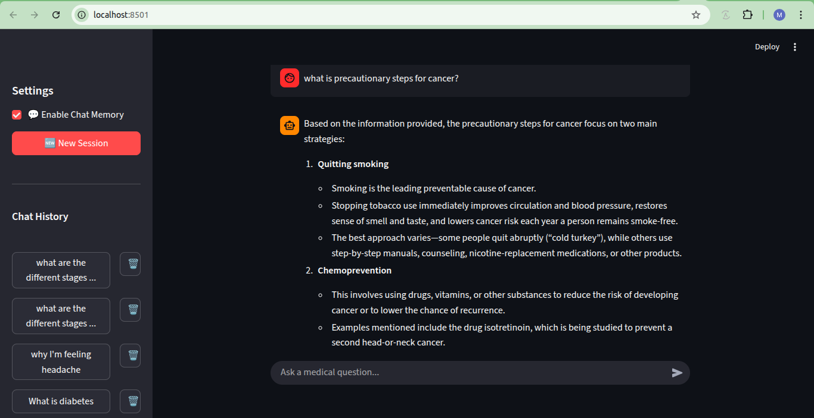
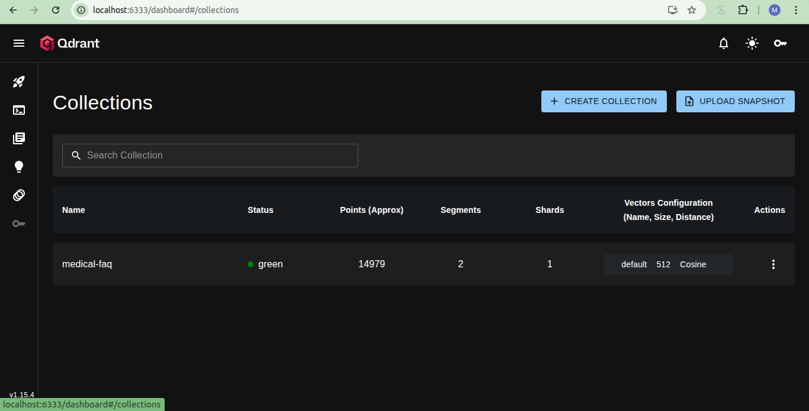
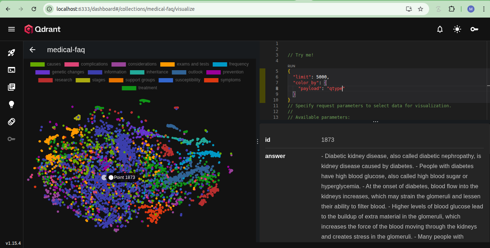
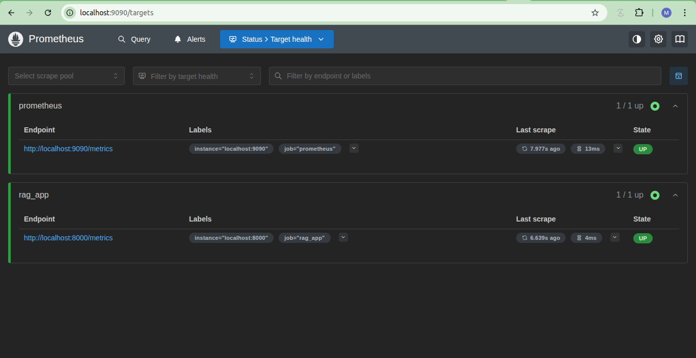

# 🩺  Mindra — Medical RAG System

This repository implements a **Retrieval-Augmented Generation (RAG)** system for **medical question-answering**, built on top of the [Comprehensive Medical Q&A Dataset](https://www.kaggle.com/datasets/thedevastator/comprehensive-medical-q-a-dataset).  
The project aims to evaluate, compare, and optimize different retrieval and hybrid search techniques (BM25, Elasticsearch, MinSearch, Qdrant vector search, and reranking) for building a **trustworthy AI medical assistant**.

---

## 💡 Problem Statement

Medical professionals and patients often search for accurate and contextually relevant information from large knowledge bases. Traditional retrieval systems (like keyword search) fail to capture **semantic relationships** between questions and answers.  
This project develops a **Retrieval-Augmented Generation (RAG)** pipeline that:

1. Parses and cleans a large medical FAQ dataset.  
2. Embeds and indexes the data using multiple vector databases.  
3. Performs hybrid and reranked retrieval.  
4. Evaluates and compares search quality using metrics like Hit@K and MRR.  
5. Integrates the best-performing system into a **Streamlit-powered conversational assistant**.

---

## 📦 Dataset

**Source:** [Comprehensive Medical Q&A Dataset — Kaggle](https://www.kaggle.com/datasets/thedevastator/comprehensive-medical-q-a-dataset)  
The dataset contains a diverse collection of **medical questions and expert answers** across multiple categories such as:
- information  
- symptoms  
- inheritance  
- causes  
- research
  etc.

It is ideal for evaluating retrieval and RAG systems because it includes structured question-answer pairs that can be semantically indexed and retrieved.

---

## 📂 Project Structure


```
medical-assistant-rag/
│── main.py                  # Streamlit UI
│── run_all.sh              # One-command script (setup + ingestion + run)
│── requirements.txt        # Dependencies (main)
│── docker-compose.yml      # container for qdrant, promethus, graffana
│
├── src/                   # streamlit app files
│   ├── utils.py        # helper function
│   ├── config.py         # config variables loading
│   └── embeddings.py   # generate embeddings
│   └── retriever.py   # retrieve query
│   └── reranker.py   # reranked the retrived results
│   └── monitoring.py   # monitring metrics
│
├── datataset/
│   ├── medical_qa_raw.csv                 # raw dataset
│   ├── medical_qa_documents_with_id.json  # Cleaned and preprocessed data
│   ├── search_ground-truth-data.csv       # ground truth question generated
│   ├── rag_eval_results_gpt{model_name}.csv/  rag_evaluation with ground truth data# 
│
├── notebook/
│   ├── 01-preprocessing_and_parse_faq.ipynb
│   ├── 02-indexing_with_minsearch_and_rag_flow.ipynb
│   ├── 03-indexing_with_elasticseach_and_rag_flow.ipynb
│   ├── 04a-generate_embedding_vector.ipynb
│   ├── 04b-indexing_with_vector_search_qdrant_and_rag_flow.ipynb
│   ├── 05a-retrieval_evaluate_data_generation.ipynb
│   ├── 05b-retrieval_evaluation_elastic_qdrant_and_minsearch.ipynb
│   ├── 06-rag_evaluator_with_Qdrant_vector_search.ipynb
│   ├── 07-hybrid_search_and_reranking_with_evaluation.ipynb
│   ├── README.md       # explaining each file
├── scripts/
│   ├── 01-preprocessing_and_parse_faq.py
│   ├── 02-indexing_with_minsearch_and_rag_flow.py
│   ├── 03-indexing_with_elasticseach_and_rag_flow.py
│   ├── 04a-generate_embedding_vector.py
│   ├── 04b-indexing_with_vector_search_qdrant_and_rag_flow.py
│   ├── 05a-retrieval_evaluate_data_generation.py
│   ├── 05b-retrieval_evaluation_elastic_qdrant_and_minsearch.py
│   ├── 06-rag_evaluator_with_Qdrant_vector_search.py
│   ├── 07-hybrid_search_and_reranking_with_evaluation.py
│   ├── README.md       # explaining each file

```

---


## ⚙️ Tech Stack

| Component        | Technology Used |
|------------------|-----------------|
| Vector Store     | Qdrant |
| Search Engine    | Elasticsearch, MinSearch, VectorSearch |
| Embeddings       | SentenceTransformers |
| LLM Integration  | Groq API (LLM Inference) |
| Reranker         | Cross-Encoder (Sentence Transformers) |
| Evaluation       | Custom metrics (Hit@K, MRR) |
| Frontend (UI)    | Streamlit |
| Environment      | conda, Python 3.10+|

---

## Rag App Features

- **Conversational Chat Interface** with Streamlit
- **Hybrid Retrieval-Augmented Generation (RAG)** using Qdrant (dense & BM25 vectors)
- **LLM-Powered Answers** using Groq
- **Chat Memory Support** to store past sessions
- **Feedback Tracking** (👍/👎) with Prometheus metrics
- **Real-time Monitoring**:
  - Total queries processed
  - Response time histograms
  - Active sessions
  - User feedback counts
- **Grafana Dashboards** for visualizing metrics


## 🚀 Setup Instructions
### Prerequisites

- Python 3.10+ (tested with Python 3.10, conda env)
- Groq API key
- Docker & Docker Compose

### installation
1. Using MakeFile
   Run the following command to **create the Conda environment and check prerequisites**:
   ```bash
   # automatically create conda env and installed the required packages
   make setup
   # Format code with black and isort
   make format

   # Check all the available command in make
   make help
   ```
   
2. using conda and pip command manually
```bash
```bash
# create conda env of python 3.10
conda create -n rag_app python=3.10

# clone the repository
git clone https://github.com/MuhammadShifa/medical-assistant-rag.git

# installed the requirements.txt file in conda env located in root dir
pip install -r requirements.txt

```
### Run the application

1. **Start the services with Docker Compose:**
   
  PostgreSQL (db) on port 5432\
  Prometheus on port 9090\
  Grafana on port 3000

```bash
docker-compose up
```
2. Access the Dashboards

- **Qdrant:** [http://localhost:6333/](http://localhost:6333/)  
- **Prometheus:** [http://localhost:9090/targets](http://localhost:9090/targets)  
- **Grafana Dashboard:** [http://localhost:3000/](http://localhost:3000/)  
  - **Email or Username:** admin  
  - **Password:** admin  

3. Run the Streamlit Application

```bash
streamlit run main.py --server.address=0.0.0.0

# Access the rag app in your browser
Default app URL: http://localhost:8501

```
🖼️  
---

🖼️  
---

🖼️ 
---

🖼️ 
---

## Metrics

The following metrics are exposed via **Prometheus**:

| Metric                    | Description                         |
|----------------------------|-------------------------------------|
| `rag_request_count_total`  | Total number of queries processed   |
| `rag_response_time_seconds`| Histogram of response time per request |
| `rag_user_feedback_total`  | Counts of positive/negative feedback |
| `rag_active_sessions`      | Number of active chat sessions     |

## Configure the Grafana Dashboard with Promethus
1. Open Grafana: [http://localhost:3000](http://localhost:3000)  
2. Log in (`admin`/`admin` by default)  
3. Add **Prometheus** as a data source (`http://localhost:9090`)  
4. Create dashboards/panels for the above metrics or import a preconfigured dashboard  

**Example queries:**

- Total requests: `rag_request_count_total`  
- Average response time: `rag_response_time_seconds_sum / rag_response_time_seconds_count`  
- Active sessions: `rag_active_sessions`  
- User feedback: `rag_user_feedback_total`
  
---

## 🙌 Acknowledgments

- [DataTalksClub](https://datatalks.club) for the LLM Zoomcamp  
- xAI for the LLM Groq API  
- My sincere gratitude to Alexey Grigorev and the DataTalksClub team for their expert guidance, valuable Slack  support, and for creating this exceptional learning opportunity of industry standard skills.

---

## 👤 Author

Developed as part of LLM Zoomcamp 2025 by Muhammad Shifa

